# Selenium Android Mobile

### Resumen

Este proyecto contiene el template de proyecto inicial del framework, sobre el que deben basarse las pruebas automatizadas de Mobile. Tiene como objetivo ofrecer una forma sencilla de realizar pruebas automatizadas que requieran todo el sistema en funcionamiento y comprueba sus requisitos a fondo.

### Prerequisites

Para utilizar este framework es necesario poseer instalado:

1. \[Java JDK\] ([Descargar](https://www.oracle.com/cl/java/technologies/javase/jdk11-archive-downloads.html)) ya que este es un proyecto en Java.
    * Una vez instalado, asegurarse que se encuentren configurada la variable de sistema `JAVA_HOME` y que se encuentre dentro del path.
        * Configurar en Windows:
            * Abir el explorador de archivos e ir a la pestaña Equipo
            * Hacer click en Propiedades
            * Hacer click en Configuración avanzada del sistema
            * Hacer click en Opciones avanzadas
            * Hacer click en variables de entorno
            *   En la sección variables de sistema revisar que se encuentre la variable` JAVA_HOME`
                *   Si no se encuentra hacer click en Nueva:
                *   En nombre de variable indicar `JAVA_HOME`
                *   En valor de la variable indicar la dirección donde se instaló el JDK (por ej: C:\java\jdk)
                *   Hacer click en aceptar
            *  Hacer doble click en la variable path
            *  Revisar que entre sus líneas se encuentre `%JAVA_HOME%\bin`
                * Si no se encuentra hacer click en Nuevo
                * Agregar el valor `%JAVA_HOME%\bin`

            *  Hacer click en Aceptar
            *  Abrir consola de comandos
            *  Escribir` java -version`
                *  Deberia devolver un valor similar al siguiente  :
               ```  
                openjdk version "11.0.16.1" 2022-08-12 LTS
                OpenJDK Runtime Environment Corretto-11.0.16.9.1 (build 11.0.16.1+9-LTS)
                OpenJDK 64-Bit Server VM Corretto-11.0.16.9.1 (build 11.0.16.1+9-LTS, mixed mode)
               ```
2. \[Maven\] ([Descargar](https://maven.apache.org/download.cgi)) ya que la estructura utilizada es Maven.
    *  Una vez instalado, asegurarse que se encuentren configurada la variable de sistema `MAVEN_HOME` y que se encuentre dentro del path.
    *  Configurar en Windows:
        * Abir el explorador de archivos e ir a la pestaña Equipo
        * Hacer click en Propiedades
        * Hacer click en Configuración avanzada del sistema
        * Hacer click en Opciones avanzadas
        * Hacer click en variables de entorno
        * En la sección variables de sistema revisar que se encuentre la variabla `MAVEN_HOME`
            *   Si no se encuentra hacer click en Nueva:
            *   En nombre de variable indicar `MAVEN_HOME`
            *   En valor de la variable indicar la dirección donde se instaló el MAVEN (por ej: C:\apache\maven\apache-maven-3.6.3-bin\)
            *   Hacer click en aceptar
        * Hacer doble click en la variable path
        * Revisar que entre sus lineas se encuentre` %MAVEN_HOME%\bin`
            * Si no se encuentra hacer click en Nuevo
            * Agregar el valor ` %MAVEN_HOME%\bin`
        * Hacer click en Aceptar
        * Abrir consola de comandos
        * Escribir` mvn -version`
            *  Deberia devolver un valor similar al siguiente  :

    ```  
            Apache Maven 3.8.6 (84538c9988a25aec085021c365c560670ad80f63)
            Maven home: /opt/homebrew/Cellar/maven/3.8.6/libexec
            Java version: 11.0.16.1, vendor: Amazon.com Inc., runtime: /Users/sebastian/Library/Java/JavaVirtualMachines/corretto-11.0.16.1/Contents/Home
            Default locale: es_419, platform encoding: US-ASCII
            OS name: "mac os x", version: "12.2.1", arch: "x86_64", family: "mac"
     ```
3. \[IntelliJ Community\] ([Descargar](https://www.jetbrains.com/idea/download/#section=windows)) IDE para su ejecución
4. \[Appium desktop\] ([Descargar](https://github.com/appium/appium-desktop/releases/tag/v1.22.3-4))
5. \[Appium inspector\] ([Descargar](https://github.com/appium/appium-inspector/releases))

### Configuración de simuladores

* Android
    * \[Android Studio\] ([Descargar](https://developer.android.com/studio))  Debe ser instalado para poder emular dispositivos Android.
        * Para crear u simulador debe entrar a la opción Configure -> AVD Manager

      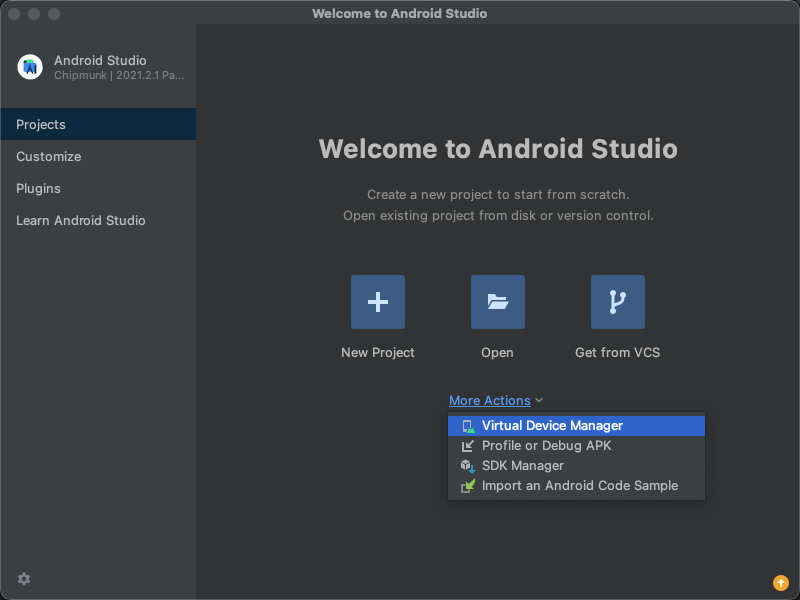

        * Dentro del Manager seleccionamos Crear Virtual Device

      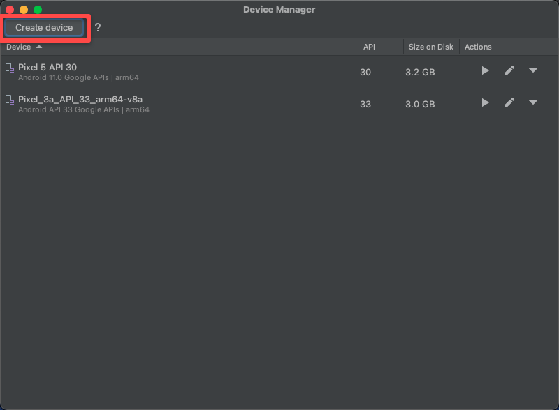

        * Seleccionamos Phone en Category y un modelo de Device

      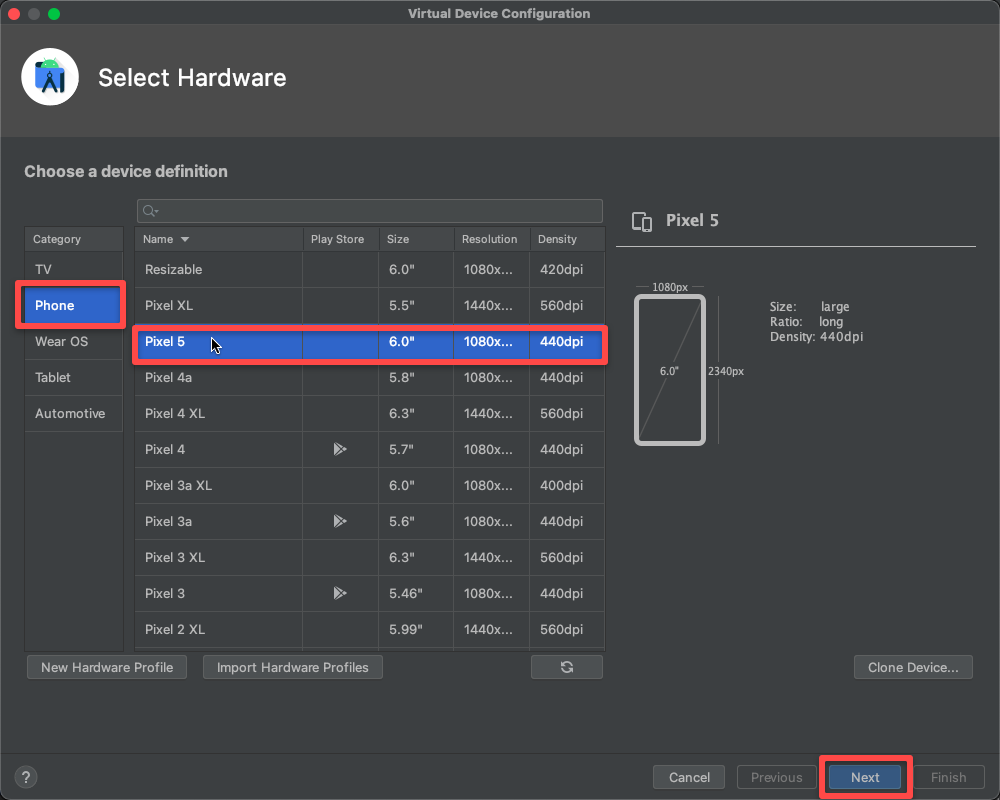

        * Seleccionamos un sistema operativo

      

        * Asignamos un nombre.(Opcionalmente podemos modificar algunos parámetros como RAM y Memoria interna)

      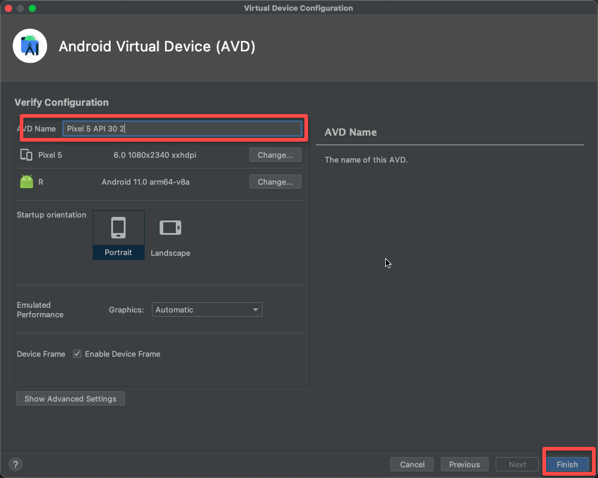

        * Una vez creado ejecutamos el simulador creado

      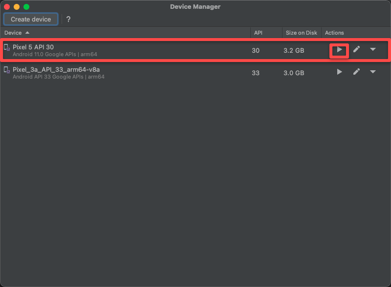

      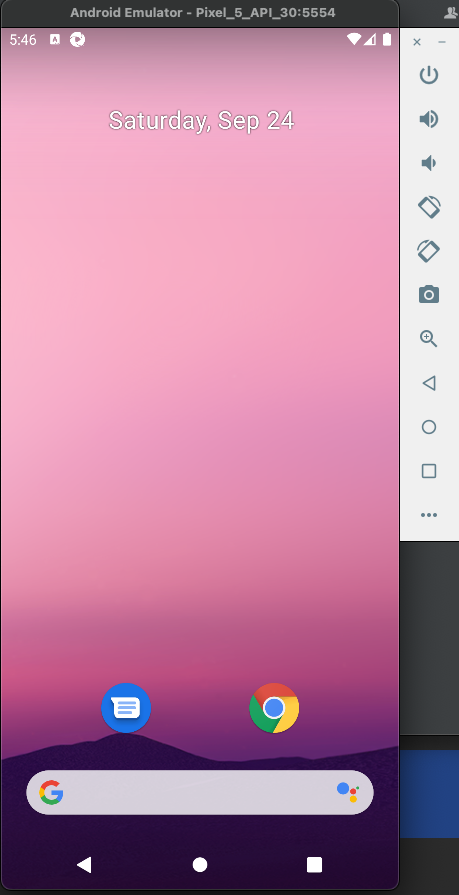

### Configuración de Appium desktop
* Para esta configuración abrimos appium y nos vamos a la sección de “Edit Configurations”.
  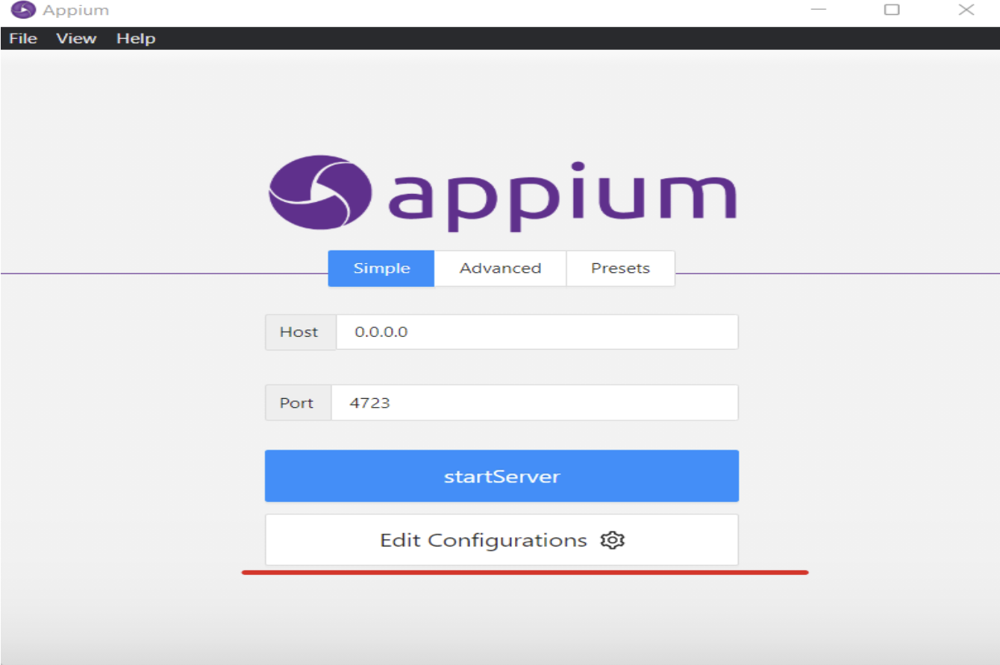

* Habiendo ingresado a dicha sección tenemos que configurar la variable de entorno ANDROID_HOME con la ruta donde se encuentra la carpeta SDK de android studio. Pueden encontrarla de manera rápida en la sección More actions > Sdk Manager de android studio.
  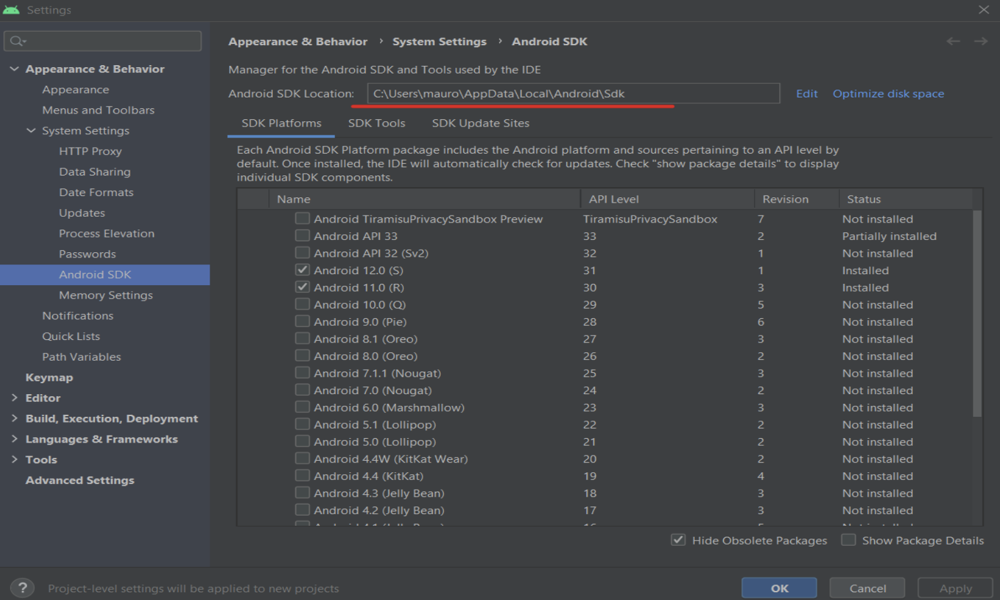

* Una vez sabida esta ruta, la copiamos y pegamos en appium y le damos a “Saved and Restart”
  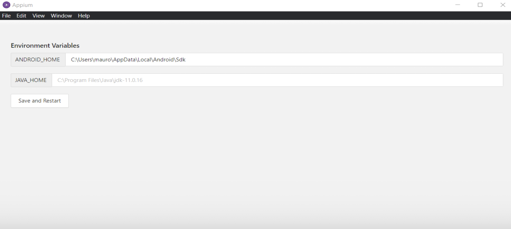

* Lista la configuración del servidor, de esta manera podemos darle a “startServer” para que de esta manera levantemos el servidor para poder utilizar appium inspector con el emulador de android studio. Los valores de Host y Port se dejan con los que viene predeterminado que son los que se ven en la imagen.
  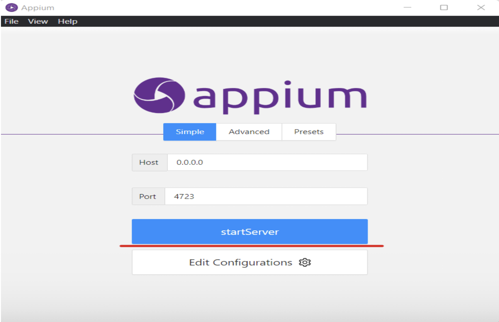

### Configuración de Appium inspector
* En la sección Appium Server vamos a configurar las capabilities del emulador que vamos a utilizar y la configuración para poder levantar el servidor. Para saber más sobre estas capabilities y sus funcionalidades se puede leer la documentacion de appium.

    * Remote Path: /wd/hub

    * Json Representation:
  {
  "app": "C://Users//mauro//Documents//selenium-android-mobile//src//apps//qarelese25.apk",
  "platformName": "Android",
  "automationName": "UiAutomator2",
  "deviceName": "emulator-5554",
  "platformVersion": "12.0.0",
  "udid": "emulator-5554"
  }
    * “App”: seteamos la ruta donde esta la apk que vamos a utilizar
    * “platformName”: seteamos el tipo de dispositivo, en este caso Android.
    * “automationName”: seteamos el driver a utilizar, en este caso “UiAutomator2”
    * “deviceName”: seteamos el nombre de dispositivo, esté lo podemos sacar desde la consola de la manera explicada en la sección “Cómo saber el nombre de mi dispositivo”.
    * “platformVersion”: seteamos la versión de Android.
    * “Udid”: seteamos el mismo valor del nombre de dispositivo.
      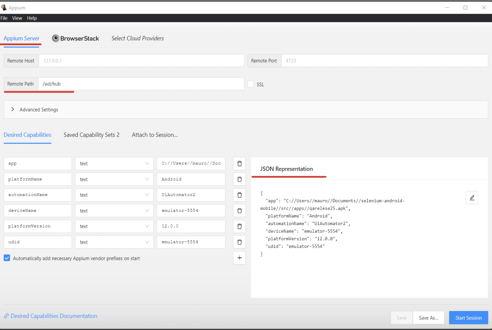
* Una vez realizada la configuración le damos a “Start Session” y de esta manera ya podemos usar y encontrar los localizadores para poder realizar los test.
  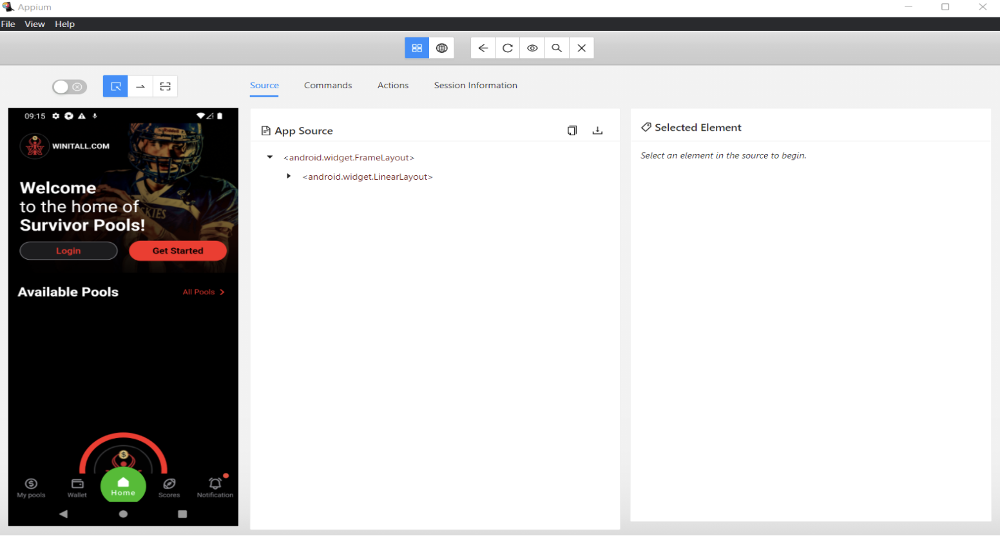


### Instalación del proyecto

Selenium Android Mobile es un proyecto Maven, para su instalación hay que descargar el proyecto del repositorio. En este proyecto podemos encontrar features de ejemplo y como se debe utilizar el Framework.
Para este POC el repositorio es:
(https://gitlab.com/dualbootpartners/internal/uy/testing/selenium-android-mobile/-/tree/develop)

Para poder descargarlo debemos crear una carpeta dentro del directorio C:/ (por ejemplo C:/selenium-android-mobile/)

* Abrimos un terminal dentro de esa carpeta y escribimos los siguientes comandos

  ```
   git init
   git clone https://gitlab.com/dualbootpartners/internal/uy/testing/selenium-android-mobile.git
   ```

* Una vez se ha descargado abrimos el proyecto con el IDE configurado y veremos la estructura del proyecto
    * En el directorio del proyecto buscar el archivo   `pom.xml`
    * Le damos click derecho al archivo
    * Hacemos click en Update Project
    * Listo, deberían estar todas las depencias instaladas

Listo, ya deberíamos ser capaces de ejecutar los feature de ejemplos que se encuentran dentro del proyecto.

### Estructura del proyecto

```  
├── src  
│   ├── apps                                                  # Aqui depositaremos el binario con el que se ejecutaran las pruebas  
│   ├── test                                                  #Suites de pruebas  
│   │   ├── java
│   │   │    └── [Package del proyecto]
│   │   │        ├── utils                                    # Carpeta con utilerias
│   │   │        ├── apis                                     # Aqui se encuentran las clases manager para llamar a las apis
│   │   │        ├── appiumUtils                              # Carpeta con clases para el manejo de la session de Appium y sus capabilties
│   │   │        ├── database                                 # Aqui se encuentran las clases manager para hacer consultas en la DB
│   │   │        ├── pageObjects                              # Aqui se depositaran todos los pages de la app
│   │   │        │         └── page.java                      # Esta es la clase con los locators y los metodos para interactuar con el screen
│   │   │        └── stepDefinitions                          # Aqui se depositaran todos los pagesdefinition de la app
│   │   │                  └── [Carpeta del pagedefinition]   # Cada stepdefiniton debe tener una carpeta que la contenga
│   │   │                     └── stepdefinition.java         # Estas clases contienen los steps definidos en los feature
│   │   ├── resources
│   │   │   ├── features                                      # Aqui se guardaran todos los features de las pruebas
│   │   │   │   └── example.feature
│   │   │   └── properties                                    
│   │   │      ├── database-{ambiente}.properties             # Properties para la conexion a la DB
│   │   │      ├── apis-{ambiente}.android.properties         # Properties usada para llamar a las apis
│   │   │      ├── browserstack-{ambiente}.android.properties # Properties para ejecutar nuestros en browserstack
│   │   │      └── phone-{ambiente}.properties                # Properties para ejecutar nuestras pruebas en dispositivos fisicos o emulados
└── pom.xml                                                   # Archivo que contiene las dependencias del proyecto
```

### Creación de nuevos scripts

Para generar nuevos scripts es importante mantener cierta estructura dentro del proyecto

* Crear Feature: Debe tener un nombre descriptivo y debe estar en la carpeta correspondiente
* Crear clase java de stepdefinition: Debe generarse una carpeta asociada dentro del package de stepdefinitions
    * Por ejemplo
      ```
        │    ├── stepDefinitions
        │    │    └── login 
        │    │          └── loginStepDefinitions.java
      ```
* Crear clase java de page
    * Por ejemplo
        ```
        │    ├── pageObjects
        │    │    └── loginPage.java
      
        ```

### Ejecución

Para correr los test se usa el siguiente comando:

mvn clean test -Denvironment={ambiente} -Dplatform={browserstack/phone} -Dcucumber.filter.tags=@Login

Donde:

* -Dplatform= indica si los tests se van a ejecutar en un dispositivo fisico/emulado o en un dispositivo alojado en la nube (browserstack) 
* -Denvironment= 'nombre del entorno donde se correrían los tests (QA, UAT, DEV)'
* -Dcucumber.filter.tags="@login" por ejemplo @login para correr test referidos al login
    * Puedes ejecutar mas de un tag de la siguiente manera:
        ```
        -Dcucumber.filter.tags="@login and @logout"
        ```
    * O Puedes excluir tags que no cumplan ciertas necesidades con:
        ```
        -Dcucumber.filter.tags="@login or @logout"
        ```

NOTA: Hay que estar posicionado en la consola dentro de la carpeta donde se encuentra el proyecto para ejecutar los comandos.

### Reportes

Una vez finalizada la ejecución puedes ver el reporte en la carpeta target/allure-results:

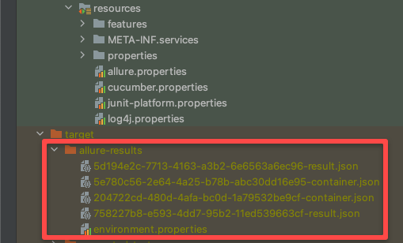

Y para levantar el reporte se deben correr los siguientes comandos:
        
        ```
        allure serve target/allure-results
        ```

